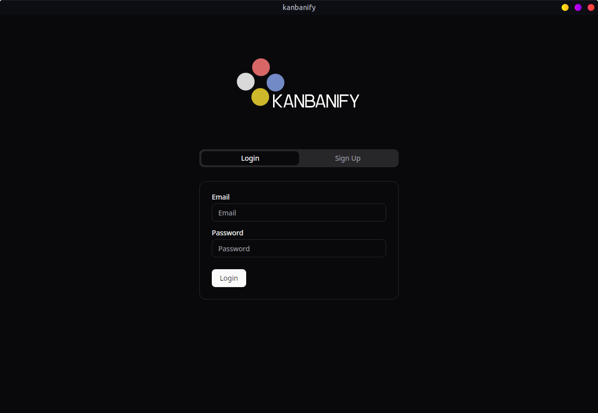
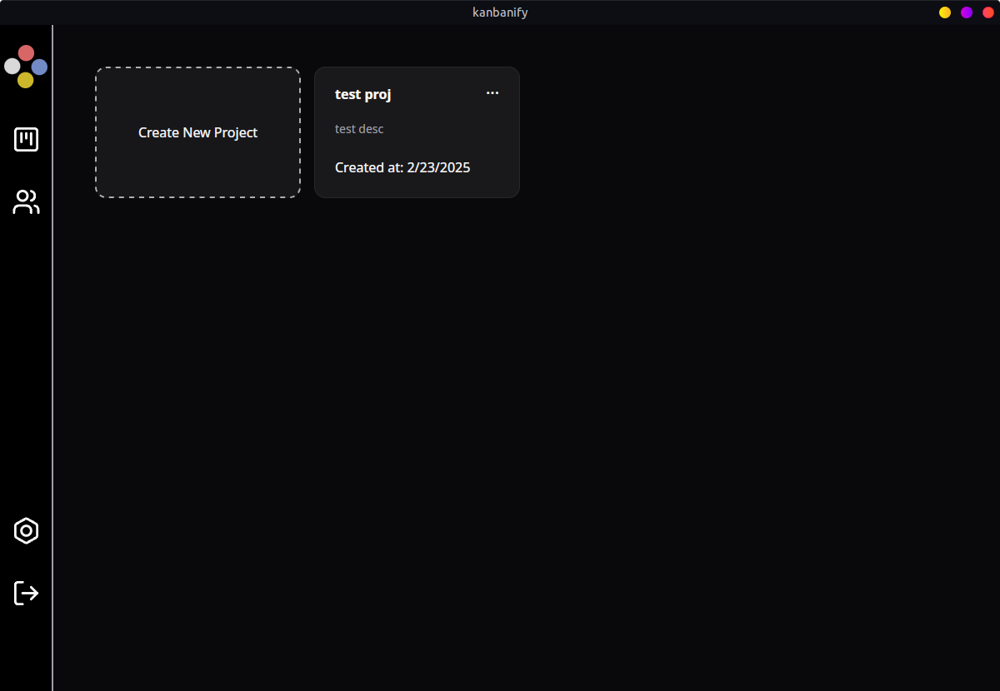
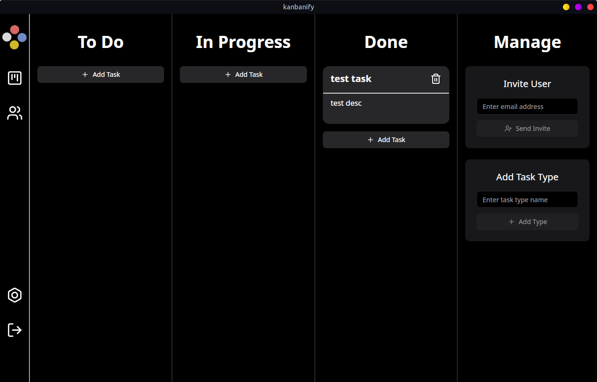
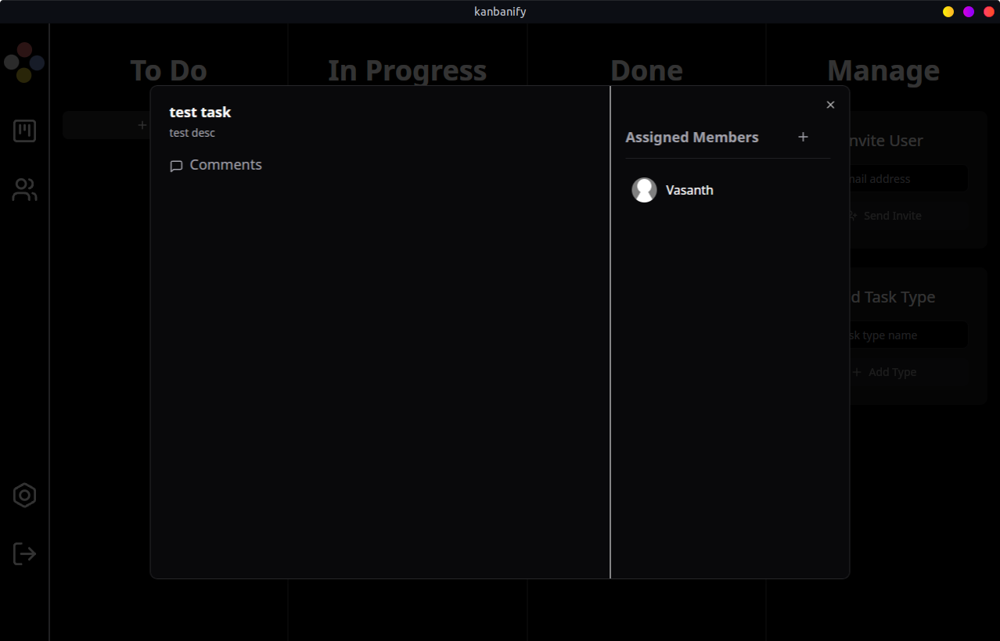

# Kanbanify

<div align="center">
  
  <p>
  A one stop solution for people who have hard time managing their projects.
  </p>
</div>

## Contents

- [**Overview**](#overview)
    - [**Features**](#features)
- [**Installation & Usage**](#installation--usage)
    - [**Prerequisites**](#prerequisites)
    - [**Installation**](#installation)
    - [**Environment Variables**](#environment-variables)
    - [**Running the project**](#running-the-project)
    - [**Building the client**](#building-the-client)
- [**Gallery**](#gallery)
- [**Team Memebers**](#team-members)

## Overview 📚

Kanbanify is a powerful and intuitive project management tool designed to help teams and individuals streamline their workflows, collaborate effectively, and manage multiple projects seamlessly. Inspired by the simplicity of Kanban boards and the functionality of GitHub Projects, Kanbanify brings a modern approach to task management and team collaboration.

---

### Features
- Create and manage Kanban boards for your projects.
- Organize tasks into customizable columns (e.g., To Do, In Progress, Done).
- Drag-and-drop functionality for easy task management.
- Invite team members to collaborate on shared boards.
- Assign tasks, leave comments, and track progress in real-time.

## Installation & Usage 🔧

### Prerequisites 📋
- Node.js
- npm or yarn
- Rust

### Installation 🔧

1. Clone the repository
```bash
git clone https://github.com/TeamNuclearCodes/Kanbanify.git
cd Kanbanify
```
2. Install the dependencies
```bash
cd server && npm install
cd ../client && npm install
```

### Environment Variables 📝
1. Server
```bash
DATABASE_URL="Postgres database uri here"
JWT_SECRET="jwt access token secret key"
JWT_REFRESH_SECRET="jwt refresh token secret key"
```
2. Client
```bash
VITE_API_BASE_URL="base url of the server"
```

### Running the project
```bash
cd server && npm run dev
```
```bash
cd client && npx tauri dev
```

### Building the client
```bash
cd client && npx tauri build
```
The executable file will be in the `client/src-tauri/target/release/` directory after building.

API documentation of Kanbanify can be found [here](https://kanbanify-716184800359.asia-south1.run.app/api-docs/)

## Gallery 📸

| Login | Dashboard |
:-:|:-:
|  |  |

| Board Page|Card Dialog |
:-:|:-:
|  |  |

## Team Members

<div align="center">
  
|  |  |
:-:|:-:
|Aaron George<br/>Abraham|Eshaan<br/>Abdulkalam|
|<a href="https://github.com/aaron-6960">@aaron-6960</a>|<a href="https://github.com/Eshaanmanath">@Eshaanmanath</a>|

| |  |
:-:|:-:
|Midhun Unni|Vasanth R|
|<a href="https://github.com/midhununni457">@midhununni457</a>|<a href="https://github.com/1337kid/">@1337kid</a>|

</div>